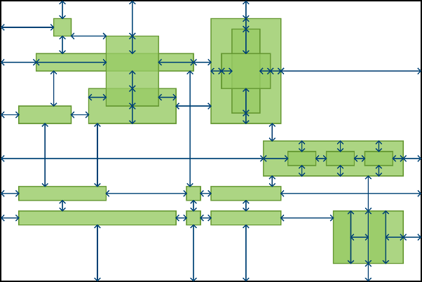

gaps.js
=======

### Algorithm for computing a useful set of measure lines between rectangles ###

[Try the interactive demo](http://daign.github.io/gaps.js/src/)

Licensed under [MIT License](https://github.com/daign/gaps.js/blob/master/LICENSE)

